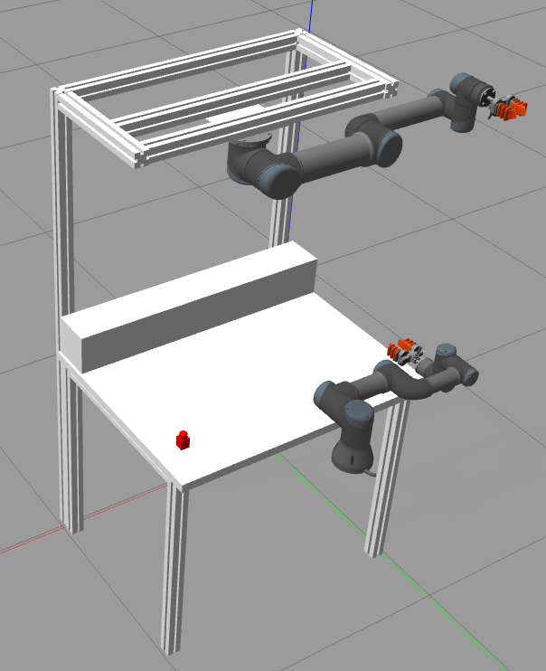

# UR5-and-UR3-simulation
Simulation of two robotic arms (UR5 and UR3) with a SoftRobotics 2 finger soft gripper


## Install the project
The project was developed with ROS noetic and Gazebo. In order to use the project:
```BASH
cd ros_ws/src
catkin_make install
source install/setup.bash
```
Add this line in the `.bashrc` for the models
```BASH
export GAZEBO_MODEL_PATH=$HOME/ros_ws/install/share/two_arms/worlds/models:$GAZEBO_MODEL_PATH
```
## Simulation
The simulation have two robotic arms: one UR5 and one UR3. They, of course, can be controlled indipendently with their topics. I've created 2 simple scripts for the UR5 and UR3 motion: `motionGroupPosController.py` for the UR5 and `motionGroupPosControllerCopy.py` for the UR3.

You can run it in this way:
- Run the simulation 
    ```BASH
    roslaunch two_arms start.launch
    ```
- Move UR5
    ```BASH
    roscd two_arms
    cd scripts
    python3 motionGroupPosController.py
    ``` 
- Move UR3
    ```BASH
    roscd two_arms
    cd scripts
    python3 motionGroupPosControllerCopy.py
    ``` 

## Known issues
Rviz visualizer not showing properly the models (for now it's not launched)
